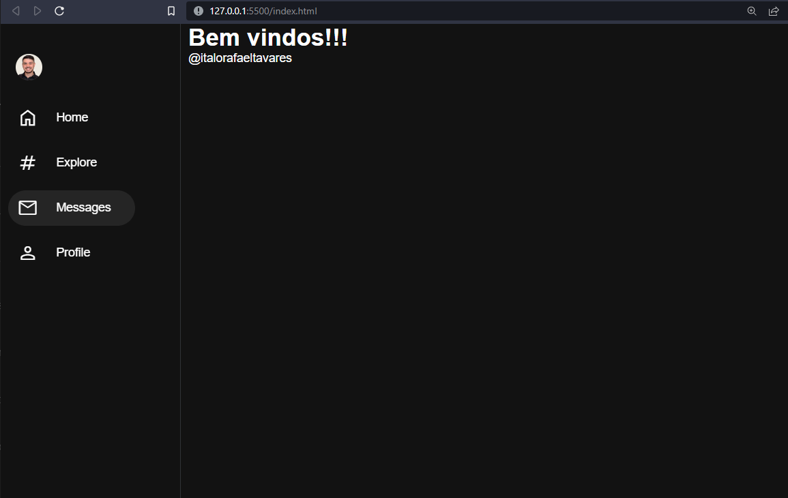
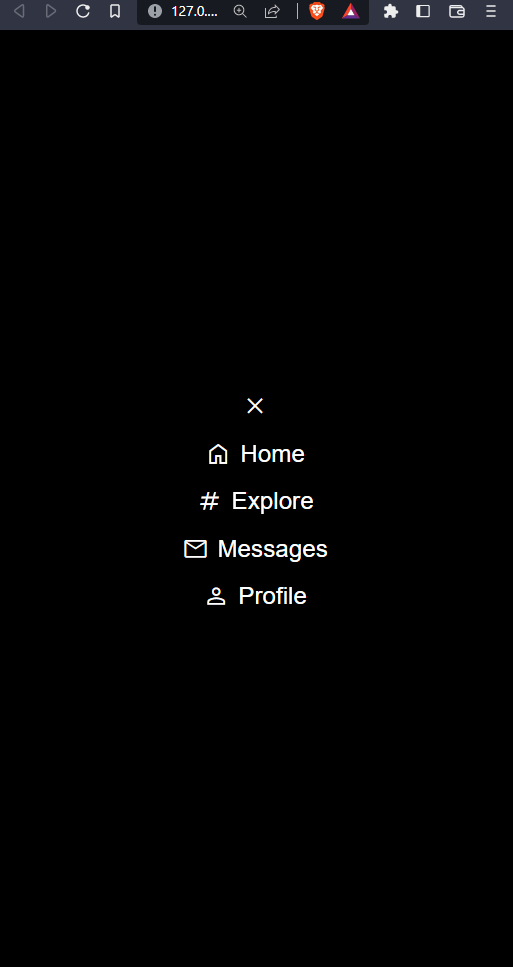

<h1>Sidebar</h1>

<strong>Criação de uma sidebar com as tecnologias  </strong>

    &emsp;  &emsp;
    
    &emsp;
    

 

> Desenvolvido apartir da <a href="https://www.youtube.com/watch?v=RlaZjCgTw9M" target=_blank><em>Aula</em></a> do Canal <a href="https://www.youtube.com/@Sujeitoprogramador" target=_blank>Sujeito programador</a>

Acesse:

 
